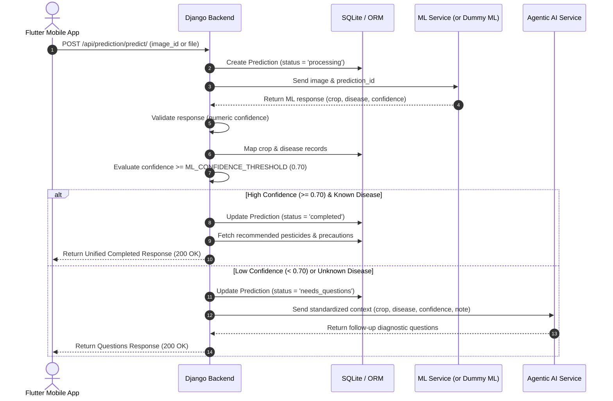

# Phytivra-AI API Documentation

## 1. Overview

The Phytivra-AI backend provides REST APIs for managing crop, disease, pesticide, recommendation, leaf image uploads, and end-to-end ML & Agentic AI disease prediction. All APIs return responses in standardized JSON format.

* **Base URL:** `http://127.0.0.1:8000/api/`
* **Content Types:** `application/json` (for standard API requests) and `multipart/form-data` (for image uploads)
* **Status Codes:** Standard HTTP status codes (200, 201, 400, 404, 422, 500, 502)

---

## 2. Architecture

The prediction pipeline decouples the Flutter mobile application from the internal AI modules (ML model, Agentic AI, and Knowledge Base/Database):

```
Flutter Client
      │
      ▼
Django API Layer (views.py)
      │
      ▼
Prediction Service Layer (prediction_service.py)
      │
      ├───► ML Service Layer (ml_service.py) ──► Real ML / Dummy ML
      │         │
      │         ▼
      │    Crop + Disease + Confidence
      │
      ├───► Database Mapping (Crop & Disease Models)
      │
      ├───► Confidence Threshold Check (settings.ML_CONFIDENCE_THRESHOLD)
      │         │
      │         ├─── High Confidence ────► Completed
      │         │
      │         └─── Low / Unknown ─────► Agentic AI Service (agent_service.py)
      │                                       │
      │                                       ▼
      │                                   Needs Questions / Refined Diagnosis
      ▼
Final Unified Response
      │
      ▼
Flutter Client
```

### Module Responsibilities

| Component | File Path | Responsibilities |
|---|---|---|
| **API Layer** | `apps/prediction/views.py` | Thin controller: parses request, calls service layer, returns DRF Response |
| **Prediction Service** | `apps/prediction/services/prediction_service.py` | Orchestrates workflow, creates tracking record, invokes ML, checks threshold, maps DB entities, constructs unified response |
| **ML Service** | `apps/prediction/services/ml_service.py` | Transports image to ML pipeline (or Dummy ML), enforces standard ML contract, validates numeric confidence |
| **Agentic AI Service** | `apps/prediction/services/agent_service.py` | Formats standardized agent input, interfaces with Agentic AI or provides structured follow-up questions |

---

## 3. Prediction Flow



---

## 4. API Endpoints

### Core Prediction Endpoints

| Endpoint | Method | Purpose |
|---|---|---|
| `/api/prediction/upload/` | `POST` | Upload leaf image (returns `image_id` and URL) |
| `/api/prediction/predict/` | `POST` | Execute end-to-end prediction (accepts `image_id` or direct `image`) |
| `/api/prediction/predict/<prediction_id>/` | `GET` | Retrieve prediction result by ID (e.g., `pred_000001`) |
| `/api/prediction/<prediction_id>/` | `GET` | Alias for prediction lookup |
| `/api/prediction/ml-result/` | `POST` | Legacy direct ML prediction receiver |

### Agentic AI Endpoints

| Endpoint | Method | Purpose |
|---|---|---|
| `/api/ai/follow-up/` | `POST` | Retrieve follow-up questions for a low-confidence prediction |
| `/api/ai/recommendation/` | `POST` | Submit answers to follow-up questions to refine diagnosis |

---

## 5. Request Format

### Option A: Two-Step Prediction Flow

#### Step 1: Upload Image
`POST /api/prediction/upload/`  
**Content-Type:** `multipart/form-data`

```text
image: [binary file] (JPG, JPEG, PNG, WEBP, max 5 MB)
```

**Upload Response (201 Created):**
```json
{
  "success": true,
  "message": "Image uploaded successfully.",
  "image_id": 1,
  "image_url": "http://127.0.0.1:8000/media/leaf_images/leaf_sample.jpg",
  "data": {
    "image_id": 1,
    "image_url": "http://127.0.0.1:8000/media/leaf_images/leaf_sample.jpg"
  }
}
```

#### Step 2: Request Prediction
`POST /api/prediction/predict/`  
**Content-Type:** `application/json`

```json
{
  "image_id": 1,
  "language": "en",
  "user_note": "Lower leaves show dark concentric spots."
}
```

### Option B: One-Step Direct Image Prediction
`POST /api/prediction/predict/`  
**Content-Type:** `multipart/form-data`

```text
image: [binary file] (JPG, JPEG, PNG, WEBP, max 5 MB)
language: en (optional, default: "en")
user_note: Lower leaves show dark concentric spots. (optional)
```

---

## 6. ML Integration

The backend interacts with the ML pipeline through `MLService`.

* When `USE_DUMMY_ML = True` or `ML_SERVICE_URL` is empty, `DummyMLService` provides deterministic, contract-identical responses for local development and testing.
* When `USE_DUMMY_ML = False` and `ML_SERVICE_URL` is set, `MLService` sends a multipart POST request with timeout `ML_SERVICE_TIMEOUT` (default: 10s).

---

## 7. ML Response Contract

All ML services (both Dummy and Production) strictly adhere to this response schema:

```json
{
  "success": true,
  "prediction_id": "pred_000001",
  "prediction": {
    "crop": {
      "id": 1,
      "name": "Tomato"
    },
    "disease": {
      "id": 1,
      "name": "Early Blight"
    },
    "confidence": 0.92
  },
  "model": {
    "name": "Phytivra-ML",
    "version": "1.0.0"
  }
}
```

### Contract Rules
1. `confidence`: Must be a numeric float between `0.0` and `1.0`. Alternative keys such as `confidence_score` or `confidence_percentage` are forbidden.
2. `disease`: When the disease cannot be determined, `id` and `name` must be `null`:
   ```json
   "disease": {
     "id": null,
     "name": null
   }
   ```
3. `model`: Contains `name` and `version` metadata.

---

## 8. Prediction Statuses

| Status | Meaning | Action Taken |
|---|---|---|
| `processing` | Prediction request received and currently running | Created before ML call to guarantee auditability |
| `completed` | Disease confidently identified (`confidence >= threshold` and disease known) | Return final diagnosis, recommendation, pesticides |
| `needs_questions` | Confidence is below threshold OR disease is unknown | Transition to Agentic AI flow; return follow-up questions |
| `failed` | ML service unavailable, timed out, or returned an invalid payload | Error recorded; HTTP 502/500 returned |

---

## 9. Confidence Threshold

* Configured centrally in `backend/config/settings.py` via `ML_CONFIDENCE_THRESHOLD`:
  ```python
  ML_CONFIDENCE_THRESHOLD = float(os.getenv("ML_CONFIDENCE_THRESHOLD", "0.70"))
  ```
* Accessed throughout the application using `apps.prediction.config.get_confidence_threshold()`.
* **Default Threshold:** `0.70` (70%).
* Any prediction with `confidence < 0.70` OR `disease == null` automatically triggers the `needs_questions` flow.

---

## 10. Low-Confidence / Agentic AI Flow

When ML produces low confidence or an unknown disease, the prediction is not treated as a confirmed diagnosis. Instead, the backend routes the context to `AgentService`.

---

## 11. Agentic AI Request

The backend constructs this standardized context payload for the Agentic AI service:

```json
{
  "prediction_id": "pred_000002",
  "language": "en",
  "ml_result": {
    "crop": {
      "id": 1,
      "name": "Tomato"
    },
    "disease": {
      "id": null,
      "name": null
    },
    "confidence": 0.48
  },
  "user_context": {
    "user_note": "Yellow spots are visible on leaves."
  }
}
```

---

## 12. Agentic AI Response

The Agentic AI service returns either refined diagnostic questions or a confirmed diagnosis:

### Agent Diagnostic Response (Status: `needs_questions`)
```json
{
  "success": true,
  "status": "needs_questions",
  "prediction_id": "pred_000002",
  "questions": [
    {
      "id": "q1",
      "type": "text",
      "question": "What specific symptoms do you observe on the leaves or stems?"
    },
    {
      "id": "q2",
      "type": "single_choice",
      "question": "Which part of the plant is predominantly affected?",
      "options": [
        "Older leaves",
        "New leaves",
        "Fruit",
        "Stem",
        "Whole plant"
      ]
    }
  ]
}
```

### Agent Completed Diagnosis (Status: `completed`)
```json
{
  "success": true,
  "status": "completed",
  "prediction_id": "pred_000002",
  "diagnosis": {
    "crop": {
      "id": 1,
      "name": "Tomato"
    },
    "disease": {
      "id": 1,
      "name": "Early Blight"
    },
    "confidence": 0.86
  },
  "recommendation": {
    "summary": "Management information is available."
  },
  "pesticides": [],
  "precautions": [],
  "sources": []
}
```

---

## 13. Final Unified Flutter Response

The Flutter application consumes a single, unified response schema regardless of whether the result originated from ML alone, ML + Agentic AI, or ML + RAG:

### Case 1: High-Confidence Completed Diagnosis
`POST /api/prediction/predict/`  
**Status:** `200 OK`

```json
{
  "success": true,
  "prediction_id": "pred_000001",
  "status": "completed",
  "result": {
    "crop": {
      "id": 1,
      "name": "Tomato"
    },
    "disease": {
      "id": 1,
      "name": "Early Blight"
    },
    "confidence": {
      "score": 0.92,
      "percentage": 92
    },
    "recommendation": {
      "available": true,
      "summary": "Management information is available for Early Blight."
    },
    "pesticides": [
      {
        "id": 1,
        "name": "Amistar",
        "company_name": "Syngenta India Ltd.",
        "description": "Broad-spectrum fungicide based on azoxystrobin.",
        "price_range": "INR 500-700",
        "packing_size": "200ml",
        "dosage": "1 ml/L",
        "spray_method": "Foliar spray",
        "precautions": "Wear protective gear",
        "image": null
      }
    ],
    "precautions": [
      "Wear protective gear",
      "Always follow the current approved product label if a pesticide is used."
    ]
  }
}
```

### Case 2: Low-Confidence / Needs Questions
`POST /api/prediction/predict/`  
**Status:** `200 OK`

```json
{
  "success": true,
  "prediction_id": "pred_000002",
  "status": "needs_questions",
  "ml_result": {
    "crop": {
      "id": 1,
      "name": "Tomato"
    },
    "disease": {
      "id": null,
      "name": null
    },
    "confidence": 0.48
  },
  "questions": [
    {
      "id": "q1",
      "type": "text",
      "question": "What specific symptoms do you observe on the leaves or stems?"
    },
    {
      "id": "q2",
      "type": "single_choice",
      "question": "Which part of the plant is predominantly affected?",
      "options": [
        "Older leaves",
        "New leaves",
        "Fruit",
        "Stem",
        "Whole plant"
      ]
    },
    {
      "id": "q3",
      "type": "single_choice",
      "question": "When did you first notice the symptoms?",
      "options": [
        "Within the last 3 days",
        "Within the past week",
        "More than a week ago"
      ]
    }
  ]
}
```

---

## 14. Error Handling

All error responses return structured JSON with consistent error envelopes:

| Scenario | HTTP Status | Response Structure |
|---|---|---|
| **Missing Image** | `400 Bad Request` | `{"success": false, "message": "Invalid prediction request.", "errors": {"image": ["Either 'image_id' or 'image' file is required."]}}` |
| **Invalid Image Format** | `400 Bad Request` | `{"success": false, "message": "Image upload failed.", "errors": {"image": ["Only JPG, JPEG, PNG and WEBP images are allowed."]}}` |
| **Image Exceeds 5 MB** | `400 Bad Request` | `{"success": false, "message": "Image upload failed.", "errors": {"image": ["Image size must not exceed 5 MB."]}}` |
| **ML Timeout** | `502 Bad Gateway` | `{"success": false, "prediction_id": "pred_000001", "status": "failed", "message": "ML prediction service was unable to process the image.", "errors": {"ml": "ML prediction service timed out."}}` |
| **ML Unavailable** | `502 Bad Gateway` | `{"success": false, "prediction_id": "pred_000001", "status": "failed", "message": "ML prediction service was unable to process the image.", "errors": {"ml": "ML prediction service unavailable."}}` |
| **Prediction Not Found** | `404 Not Found` | `{"success": false, "message": "Prediction not found."}` |

---

## 15. Dummy ML Integration

The backend includes a built-in `DummyMLService` (`apps/prediction/services/ml_service.py`):

* Enabled by default via `USE_DUMMY_ML=True` in settings.
* Produces verified predictions matching the production contract:
  ```json
  {
    "success": true,
    "prediction_id": "pred_demo_001",
    "prediction": {
      "crop": {"id": 1, "name": "Tomato"},
      "disease": {"id": 1, "name": "Early Blight"},
      "confidence": 0.92
    },
    "model": {
      "name": "Demo-ML",
      "version": "0.1.0"
    }
  }
  ```
* Supports configurable confidence and disease overrides for deterministic automated testing.

---

## 16. Testing

The backend includes 15 automated integration and unit tests in `apps/prediction/tests.py` and `apps/agenticAI/tests.py`:

```bash
# Run prediction pipeline tests
python manage.py test apps.prediction

# Run all backend tests
python manage.py test
```

### Verified Test Cases
* `test_high_confidence_prediction`: Input confidence = 0.92 $\rightarrow$ status = `completed`.
* `test_low_confidence_prediction`: Input confidence = 0.48 $\rightarrow$ status = `needs_questions`.
* `test_unknown_disease_prediction`: Disease = null $\rightarrow$ status = `needs_questions`.
* `test_ml_failure`: ML unavailable/error $\rightarrow$ status = `failed`, record persisted.
* `test_prediction_record_created_before_ml_call`: Record created before ML call.
* `test_ml_response_validation_numeric_confidence`: Strict float validation in $[0.0, 1.0]$.
* `test_crop_and_disease_db_mapping`: Case-insensitive database entity resolution.
* `test_dummy_ml_and_real_ml_contract`: Strict parity between Dummy and Real contracts.
* `test_direct_image_prediction_upload`: Multipart direct file prediction support.
* `test_prediction_detail_retrieval`: Retrieval by `pred_000001` ID.
* `test_missing_image_validation`: 400 response on missing input.
* `test_follow_up_questions_endpoint`: Agentic AI question endpoint.
* `test_ai_recommendation_submission_endpoint`: User answer submission to finalize diagnosis.

---

## 17. Configuration

Configured via environment variables (`.env` file) and `config/settings.py`:

| Variable | Default | Description |
|---|---|---|
| `ML_CONFIDENCE_THRESHOLD` | `0.70` | Threshold above which predictions are marked completed |
| `ML_SERVICE_URL` | `""` | HTTP URL of external ML prediction service |
| `ML_SERVICE_TIMEOUT` | `10` | Timeout in seconds for ML service calls |
| `AGENT_SERVICE_URL` | `""` | HTTP URL of external Agentic AI service |
| `AGENT_SERVICE_TIMEOUT` | `15` | Timeout in seconds for Agentic AI calls |
| `USE_DUMMY_ML` | `True` | Set to `False` in production to use live ML service |

---

## 18. Example Requests & Responses

### High-Confidence Flow (cURL)

```bash
curl -X POST http://127.0.0.1:8000/api/prediction/predict/ \
  -H "Content-Type: application/json" \
  -d '{"image_id": 1, "language": "en"}'
```

**Response (200 OK):**
```json
{
  "success": true,
  "prediction_id": "pred_000001",
  "status": "completed",
  "result": {
    "crop": {
      "id": 1,
      "name": "Tomato"
    },
    "disease": {
      "id": 1,
      "name": "Early Blight"
    },
    "confidence": {
      "score": 0.92,
      "percentage": 92
    },
    "recommendation": {
      "available": true,
      "summary": "Management information is available for Early Blight."
    },
    "pesticides": [],
    "precautions": [
      "Always follow the current approved product label if a pesticide is used."
    ]
  }
}
```

### Direct Multipart Image Upload (cURL)

```bash
curl -X POST http://127.0.0.1:8000/api/prediction/predict/ \
  -F "image=@tomato_leaf.jpg" \
  -F "language=en" \
  -F "user_note=Yellowing on lower leaves."
```

### Retrieving a Prediction (cURL)

```bash
curl -X GET http://127.0.0.1:8000/api/prediction/predict/pred_000001/
```

### Submitting Follow-up Answers to Agentic AI (cURL)

```bash
curl -X POST http://127.0.0.1:8000/api/ai/recommendation/ \
  -H "Content-Type: application/json" \
  -d '{
    "prediction_id": "pred_000002",
    "answers": {
      "q1": "Brown concentric spots with yellow halos.",
      "q2": "Older leaves"
    }
  }'
```

---

## 19. Existing Data APIs (Task 3 Reference)

### 19.1 Crop APIs
* `GET /api/crops/` — List all crops.
* `GET /api/crops/<id>/` — Retrieve details for a specific crop.

### 19.2 Disease APIs
* `GET /api/diseases/` or `GET /api/disease/` — List all diseases.
* `GET /api/diseases/<id>/` or `GET /api/disease/<id>/` — Retrieve disease details.

### 19.3 Pesticide APIs
* `GET /api/pesticides/` — List all pesticides.
* `GET /api/pesticides/<id>/` — Retrieve pesticide details.

### 19.4 Recommendation API
* `GET /api/recommendations/<disease_id>/` — List recommendations and pesticides for a disease.

---

## 20. Integration Notes

1. **Flutter Integration**: Flutter developers should call `POST /api/prediction/predict/`. Flutter does not need to handle model versions, ML transport, or threshold math. If `status == "completed"`, render the diagnosis and recommendations. If `status == "needs_questions"`, render the questions list and submit answers to `POST /api/ai/recommendation/`.
2. **Backward Compatibility**: Existing Task 3 endpoints (`/api/prediction/upload/` and `/api/prediction/ml-result/`) remain fully functional.
3. **Audit Trail**: Every prediction is created in the database before external ML processing. Failed predictions remain in the database with `status = "failed"` and the error details stored in `error_message`.
